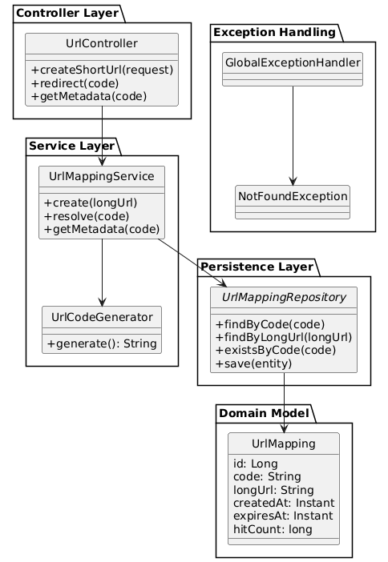
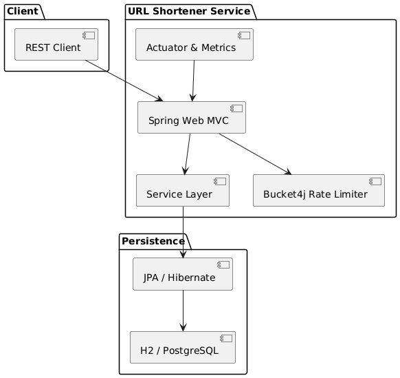

# URL Shortener Microservice

A production-ready, RESTful URL shortening service built with Spring Boot. This microservice converts long URLs into short, manageable codes and provides redirection, analytics, and management capabilities.

## Project Goal

Create a clean, scalable microservice that:
- Converts long URLs into short codes
- Stores mappings efficiently with persistence
- Provides reliable redirection
- Offers analytics and metadata
- Handles edge cases and errors gracefully
- Supports monitoring and observability
- Can be containerized for easy deployment

## Features

### Core Features
- **URL Shortening**: Convert long URLs to 6-character short codes
- **Redirection**: HTTP 302 redirects to original URLs
- **Idempotent Operations**: Same URL returns same short code
- **Expiration Support**: URLs expire after configurable time
- **Analytics**: Track click counts and access timestamps
- **Validation**: URL format and length validation
- **Collision Handling**: Automatic retry on code collisions

### Advanced Features
- **Rate Limiting**: Protect against abuse (10 requests/minute)
- **Monitoring**: Spring Boot Actuator with custom metrics
- **API Documentation**: OpenAPI 3 with Swagger UI
- **Container Support**: Docker and Docker Compose
- **Database Options**: H2 (dev) and PostgreSQL (prod)
- **Error Handling**: RFC 7807 Problem Details
- **Scheduled Cleanup**: Automatic removal of expired URLs

## Tech Stack

- **Java 17** - Programming language
- **Spring Boot 3.1.5** - Framework
- **Spring Data JPA** - Persistence
- **H2 Database** - In-memory development database
- **PostgreSQL** - Production database
- **Springdoc OpenAPI** - API documentation
- **Bucket4j** - Rate limiting
- **Micrometer** - Metrics and monitoring
- **JUnit 5 & Mockito** - Testing
- **Testcontainers** - Integration testing
- **Docker** - Containerization

## URL Architecture Diagram

This diagram shows how a long URL is converted to a short URL, stored, and resolved:
### Class Diagram

### Component Diagram

### Create Url Diagram

### Redirect Diagram

## Assumptions

### Code Generation & Collision Handling
- **Base62 Encoding**: Codes are alphanumeric strings (A-Z, a-z, 0-9) generated randomly
- **Collision Resolution**: Automatic retry mechanism generates new codes until a unique one is found
- **Length**: Default 6-character codes (approximately 56 billion possible combinations)

### Data Model & Behavior
- **Expiration Support**: Optional expiry dates are supported (`expiresAt` field is nullable)
- **Hit Counting**: Access counters (`hitCount`) increment automatically on each redirect
- **Database Flexibility**: 
  - Default: H2 in-memory database for development
  - Production-ready: PostgreSQL supported via configuration changes
- **Idempotency**: Creating the same long URL returns the existing short code

### Service Characteristics
- **Stateless Design**: Each request contains all necessary information
- **URL Validation**: Basic regex validation for URL format and length constraints
- **Scheduled Cleanup**: Expired URLs are automatically cleaned up daily

## Observability & Metrics

### Spring Boot Actuator Endpoints
- **Health Checks**: `GET /actuator/health` - Application and database health status
- **Metrics**: `GET /actuator/metrics` - Comprehensive application metrics
- **Prometheus**: `GET /actuator/prometheus` - Metrics in Prometheus format
- **Info**: `GET /actuator/info` - Application information and build details

### Custom Metrics
| Metric Name | Type | Description |
|------------|------|-------------|
| `shortener.redirect.total` | Counter | Total number of successful URL redirects |
| `http.server.requests` | Timer | HTTP request latency and count (auto-configured) |
| `jvm.*` | Various | JVM memory, threads, and GC metrics (auto-configured) |
| `hikaricp.connections.*` | Various | Database connection pool metrics |

### Monitoring Integration
- **Prometheus/Grafana**: Ready for integration via `/actuator/prometheus` endpoint
- **Health Checks**: Suitable for Kubernetes liveness/readiness probes
- **Logging**: Structured logging with Spring Boot defaults
- **H2 Console**: Accessible at `/h2-console` for database inspection (development only)

## Trade-offs & Design Decisions

### Persistence Layer
| Decision | Rationale | Trade-off |
|----------|-----------|-----------|
| **H2 In-memory Database** | Simplified setup, zero configuration for development | Data loss on server restart; not suitable for production |
| **JPA/Hibernate ORM** | Rapid development, type safety, automatic schema management | Potential performance overhead vs raw SQL; learning curve |
| **Automatic Schema Updates** | Easy prototyping with `spring.jpa.hibernate.ddl-auto=update` | Risk of data corruption in production; manual migrations preferred for production |

### Business Logic
| Decision | Rationale | Trade-off |
|----------|-----------|-----------|
| **Random Code Generation** | Unpredictable URLs, better security | Potential collisions requiring retry logic |
| **Simple Collision Retry** | Easy to implement and understand | Not guaranteed minimal retries under extreme load |
| **Idempotent URL Creation** | Prevents duplicate entries, efficient storage | Slightly slower first-time lookup for existing URLs |
| **Scheduled Cleanup** | Batch processing reduces database load | Temporary storage of expired URLs until cleanup runs |

### API & Security
| Decision | Rationale | Trade-off |
|----------|-----------|-----------|
| **No Authentication** | Simplified demonstration, easier testing | Not suitable for production without additional security |
| **Optional Rate Limiting** | Demonstration of pattern without complexity | Production requires distributed rate limiting for scale |
| **DTO Pattern** | Decouples API from database entities, versioning flexibility | Additional mapping code and classes |
| **RFC 7807 Error Format** | Standardized error responses, better client handling | More verbose than simple error messages |

### Architecture Patterns
| Decision | Rationale | Trade-off |
|----------|-----------|-----------|
| **Layered Architecture** | Separation of concerns, testability, maintainability | Slight performance overhead from multiple layers |
| **RESTful Design** | Standard HTTP conventions, predictable API | Some operations don't fit REST perfectly (e.g., redirects) |
| **Container-first Design** | Easy deployment, consistent environments | Additional complexity for local development setup |
| **Configuration over Code** | Flexible deployment across environments | Multiple configuration files to manage |

### Performance Considerations
| Decision | Rationale | Trade-off |
|----------|-----------|-----------|
| **No Caching Layer** | Simpler implementation, fewer moving parts | Increased database load for frequent redirects |
| **In-memory Rate Limiting** | Simple implementation, no external dependencies | Doesn't scale horizontally; per-instance limits only |
| **Synchronous Processing** | Simpler error handling and debugging | Lower throughput compared to asynchronous processing |
| **Database Indexes** | Optimized queries for common operations | Increased storage and slower writes |

## Architecture & Design Principles

### SOLID Principles Compliance

The application follows SOLID principles to ensure maintainable, scalable, and testable code:

#### **S – Single Responsibility Principle (SRP)**
*A class should have one, and only one, reason to change.*

| Class | Responsibility | Why It Follows SRP |
|-------|---------------|-------------------|
| `UrlMappingService` | Business logic (create, resolve, metadata) | Only handles URL shortening business rules |
| `UrlMappingController` | HTTP request handling for API endpoints | Only manages HTTP communication for `/api/urls` |
| `UrlRedirectController` | HTTP redirect handling | Only manages redirect responses for `/r/{code}` |
| `UrlCodeGenerator` | Short code generation | Only generates unique short codes |
| `UrlMappingRepository` | Data persistence operations | Only handles database CRUD operations |

**Result**: Each class has a single, well-defined responsibility with no mixed concerns.

#### **O – Open/Closed Principle (OCP)**
*Classes should be open for extension but closed for modification.*

**Examples in the project:**
- **Extensible Code Generation**: You could create `Base36CodeGenerator` or `HashBasedCodeGenerator` extending/implementing a `UrlCodeGenerator` interface without modifying `UrlMappingService`
- **Pluggable Metrics**: New metrics can be added by extending `MeterRegistry` without changing service logic
- **Flexible Storage**: Different `UrlMappingRepository` implementations could be swapped without modifying business logic

**Design Patterns Used:**
- Strategy Pattern for code generation
- Template Method for common service operations
- Observer Pattern for event handling (metrics, logging)

## Build & Run Instructions

### Prerequisites
- Java 17 or higher
- Maven 3.6+ or Gradle
- Docker (optional, for containerized deployment)

### Quick Start

# Build the project
./mvnw clean package

# Run tests
./mvnw test

# Run the application
./mvnw spring-boot:run

## API Documentation

### Interactive Documentation
Once the application is running, access:
- **Swagger UI**: http://localhost:8080/swagger-ui.html
